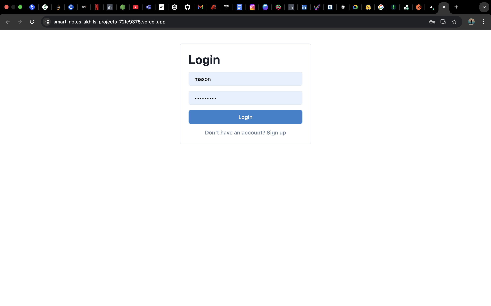
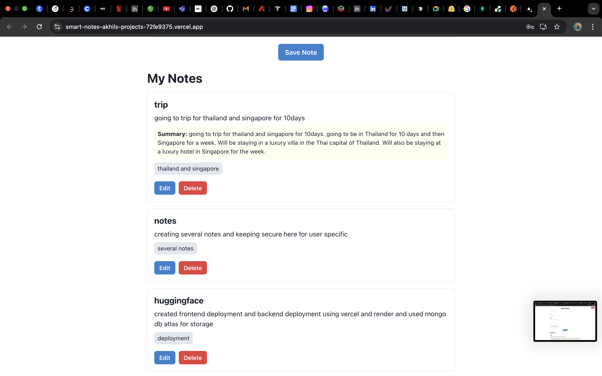
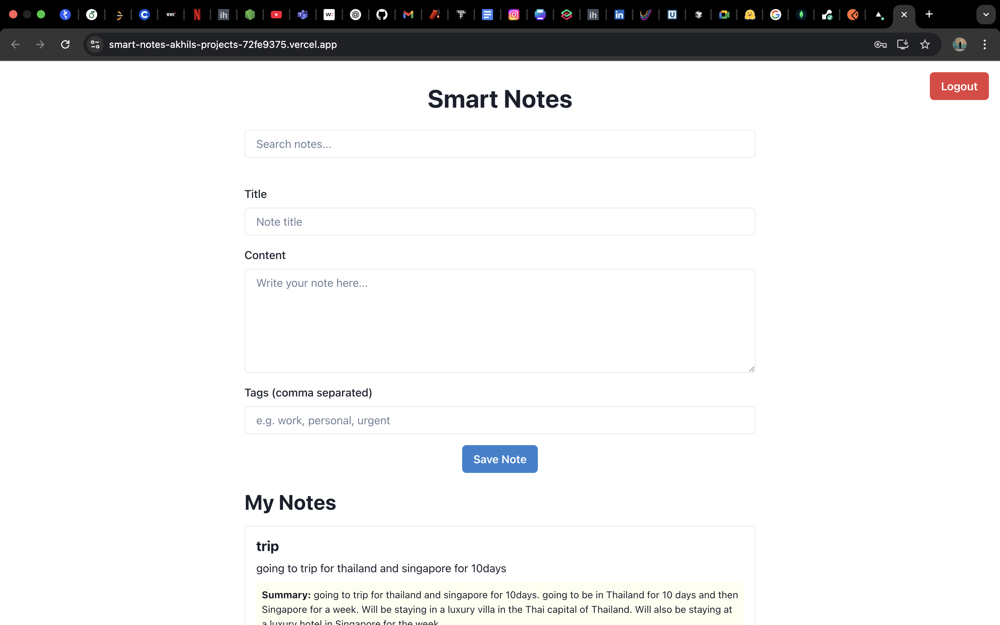

# 📝 Smart Notes

A full-stack, AI-powered note-taking app with user authentication, tag suggestions, search, pagination, and automatic note summarization using Hugging Face.

## 🌐 Live Demo

- **Frontend:** [https://smart-notes-akhils-projects-72fe9375.vercel.app](https://smart-notes-akhils-projects-72fe9375.vercel.app)
- **Backend:** [https://smart-notes-1ni5.onrender.com](https://smart-notes-1ni5.onrender.com)

## 📸 Screenshots

### Login Page



### Notes Dashboard



### Note Creation



## 🚀 Features

- **User Authentication:** Signup, login, and JWT-protected routes.
- **User-Specific Notes:** Each user sees only their own notes.
- **CRUD Operations:** Create, read, update, and delete notes.
- **AI Summaries:** Notes are automatically summarized using Hugging Face models.
- **Tag Suggestions:** Smart tag suggestions based on note content.
- **Search & Pagination:** Search notes and view them in pages (5 per page).
- **Responsive UI:** Built with React and Chakra UI.
- **MongoDB Backend:** All data is securely stored in MongoDB.

## 🖥️ Tech Stack

- **Frontend:** React, TypeScript, Chakra UI
- **Backend:** Go (Gin), MongoDB, JWT
- **AI Integration:** Hugging Face Inference API (`facebook/bart-large-cnn`)
- **Other:** Docker (for MongoDB), Axios

## ⚡ Getting Started

### 1. **Clone the Repository**

```bash
git clone https://github.com/ChennuriAkhilvarma/smart-notes-app.git
cd smart-notes
```

### 2. **Setup the Backend**

- **Install Go dependencies:**
  ```bash
  cd backend
  go mod tidy
  ```
- **Create a `.env` file:**
  ```
  HUGGINGFACE_API_KEY=your_huggingface_api_key
  MONGODB_URI=mongodb://localhost:27017
  JWT_SECRET=your_jwt_secret
  ```
- **Start MongoDB** (if not running):
  ```bash
  docker run -d -p 27017:27017 --name mongo mongo
  ```
- **Run the backend:**
  ```bash
  go run cmd/server/main.go
  ```

### 3. **Setup the Frontend**

- **Install dependencies:**
  ```bash
  cd ../frontend
  npm install
  ```
- **Start the frontend:**
  ```bash
  npm start
  ```
- The app will be available at [http://localhost:3000](http://localhost:3000).

## 🚀 Deployment

- **Frontend:** Deployed on [Vercel](https://vercel.com/)
  - Set `REACT_APP_API_URL` to backend Render URL in Vercel environment variables.
- **Backend:** Deployed on [Render](https://render.com/)
  - Set `MONGODB_URI`, `JWT_SECRET`, and `HUGGINGFACE_API_KEY` in Render environment variables.

## 🔑 Getting a Hugging Face API Key

1. Go to [Hugging Face](https://huggingface.co/settings/tokens).
2. Create a new token with "Make calls to Inference Providers" permission.
3. Paste it in your backend `.env` as `HUGGINGFACE_API_KEY`.

## 🧪 Testing

- **Signup/Login:** Create multiple users and verify user-specific notes.
- **Create/Edit/Delete Notes:** Try with/without tags, and check AI summaries.
- **Tag Suggestions:** See dynamic tag suggestions as you type.
- **Search & Pagination:** Use the search bar and pagination controls.
- **Edge Cases:** Try empty notes, long notes, and special characters (empty notes are blocked).

## ⚠️ Known Limitations

- AI summaries may sometimes repeat or closely paraphrase the original content (model limitation).
- Free Hugging Face API keys may have rate limits or downtime.
- No file/image upload support.

## 📚 Folder Structure

```
smart-notes/
  backend/
    cmd/server/         # Go main server
    internal/handlers/  # API handlers
    internal/models/    # Data models
    internal/ai/        # AI summary logic
  frontend/
    src/
      components/       # React components
      services/         # API calls
      types.ts          # TypeScript types
```

## 💡 Future Improvements

- Rich text editing
- Note sharing/collaboration
- More advanced AI features (e.g., keyword extraction, sentiment)

## Credits

- [Hugging Face](https://huggingface.co/)
- [Chakra UI](https://chakra-ui.com/)
- [Gin Web Framework](https://gin-gonic.com/)
- [MongoDB](https://www.mongodb.com/)
